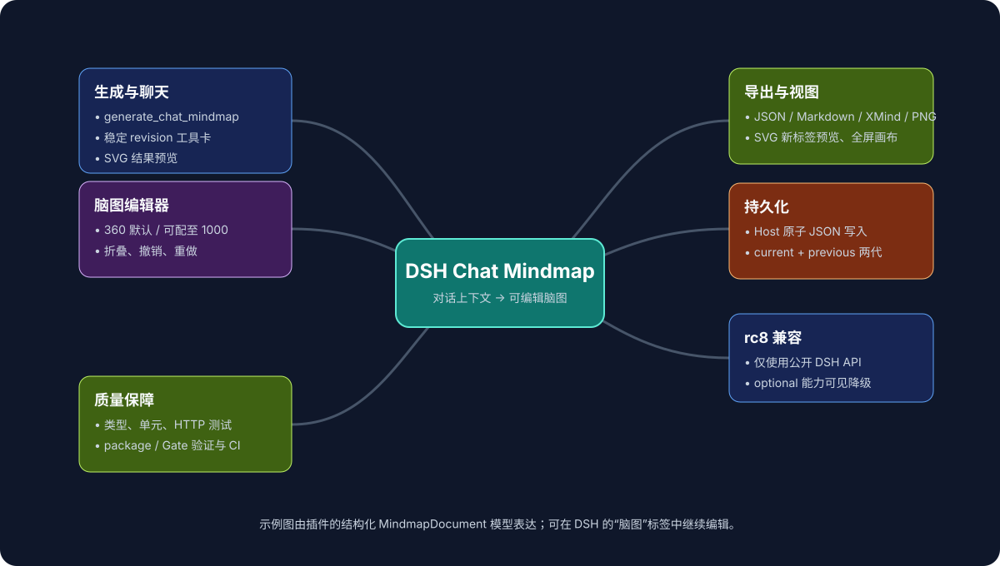

# DSH Chat Mindmap

`@dsh-external/dsh-chat-mindmap` is a DSH hybrid plugin for turning Agent-provided chat, text, PDF, image, or document context into a persistent editable mindmap library.

## Product shape

The plugin registers a peer conversation tab alongside DSH's conversation and trajectory tabs:

```text
对话 | 轨迹 | 上下文 | 脑图
```

The **脑图** tab is not a sidebar and does not permanently occupy the composer. It is a persistent library surface:

- left: global active mindmap index
- right: selected SimpleMindMap editor
- Host-owned JSON persistence under `~/.dsh/chat-mindmap/`
- archive and delete operations to avoid unbounded growth
- one `current` plus one `previous` version per library item
- manual editor changes autosave without rotating `previous`
- Agent regeneration rotates current into previous and replaces current

## MVP contract

- **Host tool:** `generate_chat_mindmap`
- **Web API:**
  - `POST /@dsh-external/dsh-chat-mindmap/generate`
  - `GET /@dsh-external/dsh-chat-mindmap/maps`
  - `GET/PATCH/DELETE /@dsh-external/dsh-chat-mindmap/maps/:id`
  - `POST /@dsh-external/dsh-chat-mindmap/maps/:id/archive`
- **UI:** `conversation.view` slot with a persistent gallery/editor; the gallery loads only when this panel mounts (never during DSH web startup), deduplicates its in-flight request, and exposes a retry state instead of leaving an indefinite loading label.
- **Renderer:** [SimpleMindMap](https://github.com/wanglin2/mind-map), split-imported instead of `full.js`
- **Exports:** JSON, Markdown, XMind, and PNG
- **Canvas view:** Open a read-only SVG preview in a new browser tab, or enter/exit a browser-native fullscreen canvas with automatic resize. Fullscreen remains an editor: double-click a node for SimpleMindMap’s inline text editor, or select it to use the visible fullscreen title/notes form. The inline `contenteditable` is explicitly mounted inside the element that enters fullscreen, so it is not hidden by the browser fullscreen top-layer boundary. Before every map/revision is handed to SimpleMindMap, the render copy always keeps only root plus the first two levels expanded; deeper branches are marked collapsed before the first layout even if a prior interactive session persisted them expanded. This is render-only and never overwrites persisted state. The default cyan theme follows the DSH shell’s light/dark contrast, while explicitly selected map themes remain unchanged. Every map/revision switch remounts the canvas in loading state before rendering, so the canvas-only spinner reliably appears.
- **Workspace shell:** A single compact Header contains sidebar collapse/expand, navigation, undo/redo, Inspector, `···`, and fullscreen—there is no duplicate canvas toolbar. The 228px searchable library becomes a narrow rail in constrained panel widths and can be fully collapsed so the canvas receives the released width. The workspace observes its actual host viewport width/height instead of assuming the conversation page height. The canvas fills the remaining bounded flex height; its light zoom pill is absolutely positioned at the lower-right, while status is an overlay and never reserves a bottom row. Low-frequency actions and exports live in `···`; map layout and theme live in the Inspector.
- **Panel regeneration:** `重新生成` starts an official one-shot `fork` child from the live session, exposes only panel-local running/completed/failed/cancelled status, and safely preserves manual edits on conflict. It intentionally does not create a DSH Job, notify the main chat, or add a chat SVG card.
- **Chat preview:** `present_chat_mindmap` returns a durable `libraryId` + content-addressed `revisionId`. The Host retains only the documented `current` plus one `previous` version; previews outside those two immutable documents expire explicitly. The client recreates an `image/svg+xml` Blob preview, shows it in an accessible dialog, and revokes its object URL on unmount. DSH `0.1.0-rc.8` does not publicly export `ImageLightbox`, so this plugin intentionally uses its own dialog and does not claim the private component.
- **New-map cancellation:** the initial draft generation is cancellable and never writes a library record. Once the explicit Host save begins, the UI labels it as a non-cancellable commit rather than falsely claiming that a persisted map was discarded.
- **Source boundary:** Agent reads attachments and supplies extracted text plus source metadata; the plugin does not retain source text by default
- **Regeneration:** the UI sends the active map/version and optional overall redraw instruction to the plugin Host. The Host supplies the outline plus every bounded node note as structured JSON reference data, and passes the overall redraw instruction separately as `<panel-note>`; it starts a bounded one-shot fork child, validates its strict Markdown outline, then atomically rotates `current` into `previous` only if the map was not manually edited during the run.

## Project overview example

The diagram below is a real project-outline example. Its editable Markdown source is [`docs/assets/project-overview-mindmap.md`](docs/assets/project-overview-mindmap.md); paste it into **脑图 → 新建** to create and edit the same map.



## Install / build

There are three different installation modes. **Do not use `dev_inject_plugin` for a normal installation**: it is a temporary live injection and is intentionally lost after DSH restarts.

### A. End user: npm package (future primary path)

`@dsh-external/dsh-chat-mindmap` npm package is not currently published. Once the maintainer publishes and verifies the package on npm, this becomes the simplest install path:

```powershell
dsh plugin --profile web add @dsh-external/dsh-chat-mindmap@0.1.1
```

`dsh plugin` forwards to pnpm, writes the dependency into `~/.dsh/profiles/web/package.json`, adds the package to `dsh.profile.bundles`, and makes it survive restart. Then restart the DSH Web profile:

```powershell
dsh web
```

If the package is published under a different scope/name, replace the package spec in the command. The package must be published with the built `lib/` directory; users should not need the source checkout or DSH source tree.

### B. End user: GitHub Release tarball (current recommended path)

For the currently published `v0.1.1`, download the release asset from [GitHub Release v0.1.1](https://github.com/EricWang1358/dsh-chat-mindmap/releases/tag/v0.1.1), then install it persistently:

```powershell
dsh plugin --profile web add file:C:/path/to/dsh-external-dsh-chat-mindmap-0.1.1.tgz
```

### C. End user: GitHub repository

```powershell
dsh plugin --profile web add github:EricWang1358/dsh-chat-mindmap#v0.1.1
```

The Git repository must contain built `lib/` artifacts, or a verified `prepare`/build workflow. The project repository is https://github.com/EricWang1358/dsh-chat-mindmap. For the most reliable user install, publish npm or attach a built tarball instead of requiring every user to compile TypeScript.

### D. End user: built `.tgz` artifact

A maintainer builds and packs the plugin:

```powershell
npm install --legacy-peer-deps
npm run build
npm pack
```

Then copy the generated `.tgz` to the target machine and install it persistently. On Windows, use a `file:` URL with forward slashes or an absolute tarball path:

```powershell
dsh plugin --profile web add file:C:/path/to/dsh-external-dsh-chat-mindmap-0.1.1.tgz
# equivalent: dsh plugin --profile web add C:/path/to/dsh-external-dsh-chat-mindmap-0.1.1.tgz
```

Restart DSH after installation. The `health` URL is an API endpoint, not a standalone app page; if the plugin is not installed/persisted, DSH's SPA fallback will return the conversation shell HTML instead of JSON. Verify the named route rather than opening it as a browser page:

```powershell
Invoke-WebRequest http://127.0.0.1:3080/@dsh-external/dsh-chat-mindmap/health
```

Expected content:

```json
{"ok":true,"plugin":"@dsh-external/dsh-chat-mindmap","version":4}
```

### E. Local developer checkout

The build uses the DSH checkout's TypeScript compiler and produces host and browser bundles:

```powershell
$env:DSH_CHECKOUT = 'D:\Program Files\nodejs\node_global\node_modules\@deepseek-ai\dsh'
npm install --legacy-peer-deps
npm run build
```

For a **persistent** local profile installation, use the supported package installer:

```text
dev_install_package {"dir":"D:/A/1NUS/1Sem/dsh-chat-mindmap","profile":"web"}
```

Only for temporary development/testing:

```text
dev_build_plugin {"dir":"D:/A/1NUS/1Sem/dsh-chat-mindmap"}
dev_inject_plugin {"dir":"D:/A/1NUS/1Sem/dsh-chat-mindmap"}
```

## Agent usage

Ask the DSH Agent to call `generate_chat_mindmap` with extracted source text. Persistence is enabled by default and the result includes `libraryId`:

```json
{
  "context": "# Project launch\n## Product\n### Scope\n## Risks\n### Timeline",
  "title": "Project launch",
  "source": {
    "kind": "pdf",
    "name": "architecture.pdf",
    "attachmentId": "attachment-id",
    "sessionId": "session-id"
  },
  "config": {
    "layout": "logicalStructure",
    "contextLimit": 80000,
    "instruction": "重点提取风险和行动项"
  }
}
```

## Persistence and lifecycle

```text
~/.dsh/chat-mindmap/
├── index.json
└── maps/
    └── <libraryId>.json
```

Each record stores metadata and bounded visual/generation settings, never the extracted source text by default. `current` and `previous` are rotated only for a new Agent result; UI autosave keeps the previous snapshot stable. Delete removes the index entry and map file. Archive hides an item from the active index without losing it.

## CI and package artifact

GitHub Actions runs the supported Node `22.18.0` verification pipeline on every pull request and push to `main`: typecheck, declaration compilation, client bundle, behavior tests, publishable-package validation, and the browser-bundle budget.

The **Package artifact** workflow runs manually or for tags named `v*`; it uploads the generated `.tgz` plus `pack-result.json` as a 30-day GitHub Actions artifact. It validates the package before producing the artifact and deliberately does not publish to npm or create a GitHub Release without an explicit maintainer release decision.

## Verification

The current browser bundle is approximately **588 KB** (**171 KB gzip**) after split imports and minification, versus the earlier multi-megabyte `full.js` bundle. CI enforces a **200 KiB gzip** client-bundle budget through `npm run verify:bundle`.

The automated source, host, package, and bundle checks pass. Browser-only interaction acceptance remains explicitly tracked in the project overview and Gate 0 evidence; do not treat those pending live checks as completed GUI E2E coverage.

The GUI verification path has been exercised:

1. Open a DSH session in workspace `1Sem`.
2. Confirm `对话 | 轨迹 | 上下文 | 脑图` appears.
3. Open `脑图`, click `新建`, paste Markdown, and click `生成并保存`.
4. The persistent library entry renders in the left list and the editable canvas renders on the right.
5. The `XMind` button becomes enabled and downloads an `.xmind` archive. The archive contains `content.json`, `content.xml`, `metadata.json`, and `manifest.json`; the generated `content.json` was inspected successfully.
6. Layout changes call SimpleMindMap's live `setLayout` and re-render path; theme changes call `setThemeConfig` and re-render immediately. The UI exposes 14 layout choices and 10 visual presets: default, Classic 4, ocean, forest, sunset, lavender, graphite, rose, amber, and high contrast.

## Design decisions

1. Agent tool and UI are two entry points over one host generator.
2. No MCP server in this version; MCP is an external integration concern, not an internal DSH transport.
3. The intermediate `MindmapDocument` is renderer-independent so Drawnix/Plait can be added later.
4. Context is bounded and regeneration prompts explicitly warn about truncation to control token cost.
5. Layout/theme/font are immediate visual settings; density, max nodes, language, and instruction affect the next Agent generation.
