# 🧠 DSH Chat Mindmap

> 从一段对话，到一张可继续推敲、重组并交付的脑图。

[](https://www.npmjs.com/package/@ericwang1358/dsh-chat-mindmap)
[](LICENSE)

DSH Chat Mindmap 是一个 DSH Web 插件：Agent 负责把对话上下文整理成结构，脑图工作台负责把结构变成成果。生成后不止得到一张图片，而是得到一份能编辑、能回退版本、能重新生成、能导出的工作成果。

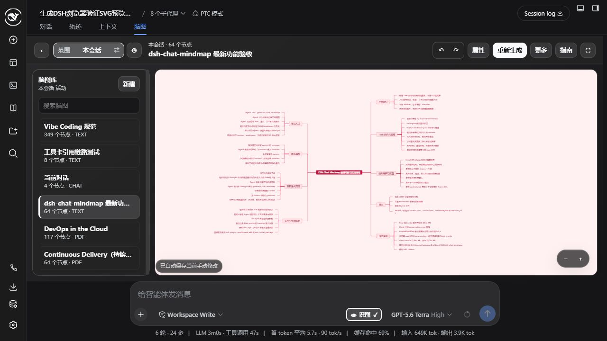

*一个真实 DSH 工作台：范围、脑图库、画布、状态与操作集中在同一处。*

## 安装

### 在 DSH Web 中使用

```bash
dsh plugin --profile web add github:EricWang1358/dsh-chat-mindmap
```

重启 DSH Web 后，打开任一会话的 **脑图** 标签。

### 作为 npm 依赖安装

```bash
npm install @ericwang1358/dsh-chat-mindmap@latest
```

适合把插件纳入自己的 DSH composition 或发布流程。公开版本以 [npm Registry](https://www.npmjs.com/package/@ericwang1358/dsh-chat-mindmap) 的 `latest` tag 为准。

## 60 秒上手

1. 在对话中请 Agent 基于当前上下文生成脑图，或调用 `generate_chat_mindmap`。
2. 等待后台任务完成，聊天中的操作卡会直接打开对应脑图页；不再依赖聊天容器对 PNG/SVG 的预览兼容性。
3. 在 **脑图** 页编辑节点、调整布局与主题。修改会自动保存。
4. 用顶部范围切换查看 **本会话** 或 **整个工作区**，再从左侧库选择要继续处理的内容。
5. 通过 **更多操作** 导出、归档、删除、恢复重新生成前的版本，或再次让 Agent 整理。

第一次进入空会话时，工作台会给出简短引导；随时可以从 **指南** 或插件设置重新打开。

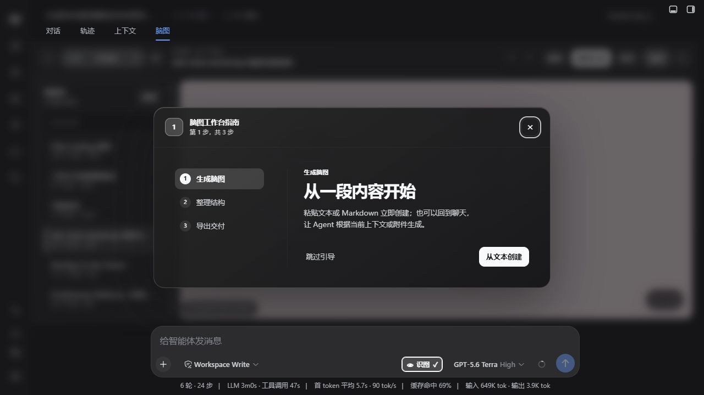

*从内容创建、在画布整理、按格式交付。每一步都对应工作台中实际可用的操作。*

## 真实流程：从聊天到结果

生成完成后，聊天流不会承担图片预览的兼容性风险，而是提供一张轻量的结果卡，直接进入与该会话绑定的可编辑脑图。这样既能继续对话，也不会丢失“回到作品”的入口。

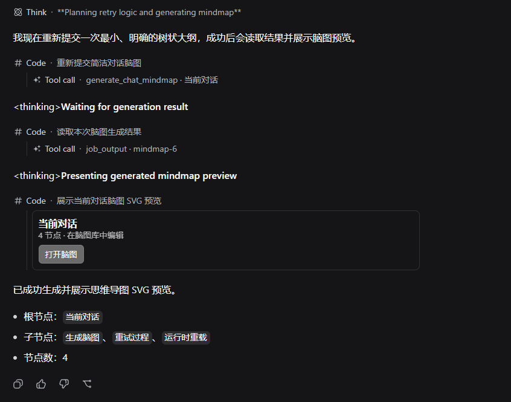

*聊天结果卡显示节点数量与编辑入口；点击 **打开脑图** 即可进入对应作品。*

## 从聊天到可交付成果

```text
对话上下文
    ↓
generate_chat_mindmap / Agent 请求
    ↓
后台生成任务 ── 完成后提供“打开脑图”
    ↓
编辑、自动保存、主题与布局、版本恢复、重新生成
    ↓
PNG / Markdown / JSON / XMind 导出
```

聊天卡只做清晰的入口。编辑、预览与导出都在专门的脑图工作台完成，因此不会把宿主聊天 UI 的图片支持当作核心依赖。

## 功能一览

| 能力 | 你可以做什么 |
| --- | --- |
| 对话生成 | 从当前 DSH 对话生成结构化脑图，后台执行，不打断继续对话。 |
| 文本建图 | 在脑图库中从一段文本或 Markdown 手动创建脑图。 |
| 作品直达 | 从聊天结果卡一键进入对应脑图页，不依赖内嵌图片预览。 |
| 会话与工作区 | 默认聚焦当前会话；需要回看时切换到整个工作区。范围控件固定宽度，标题再长也不会让界面跳动。 |
| 画布编辑 | 改节点标题和备注、增删节点、拖拽整理、缩放、全屏、展开/折叠、撤销/重做。 |
| 视觉整理 | 提供逻辑图、思维导图、组织图、目录、时间线、鱼骨图等布局，以及多种主题。 |
| 智能重整 | 对已有脑图补充要求后重新生成；运行中可取消，并可恢复重新生成前版本。 |
| 多格式交付 | 直接导出 PNG、Markdown、JSON、XMind；SVG 可在工作台预览。 |
| 生命周期 | 归档会从活动列表收起，并可在“已归档”列表查看；删除前有确认。 |

## 在工作台里推敲结构

节点不是一次性生成的静态结果。选中节点即可在右侧检查器中改标题或补充备注，并用布局、主题把同一份信息调成适合思考、汇报或复盘的形态。

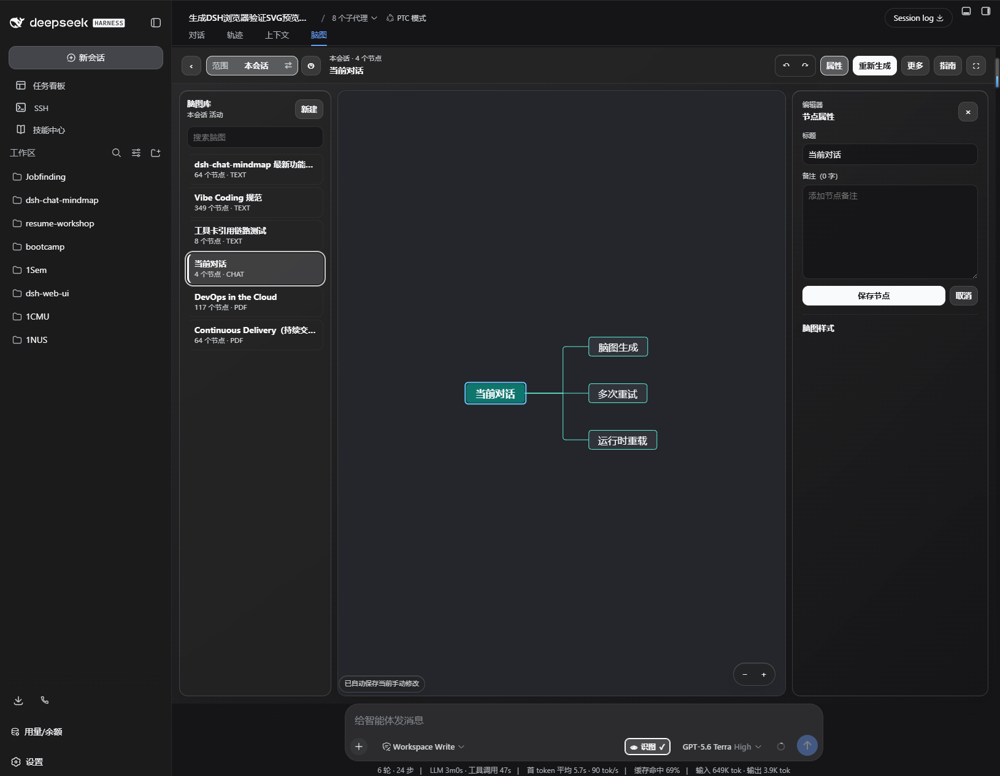

*选中节点后，可在右侧编辑标题与备注；同一面板提供结构和主题的外观设置。*

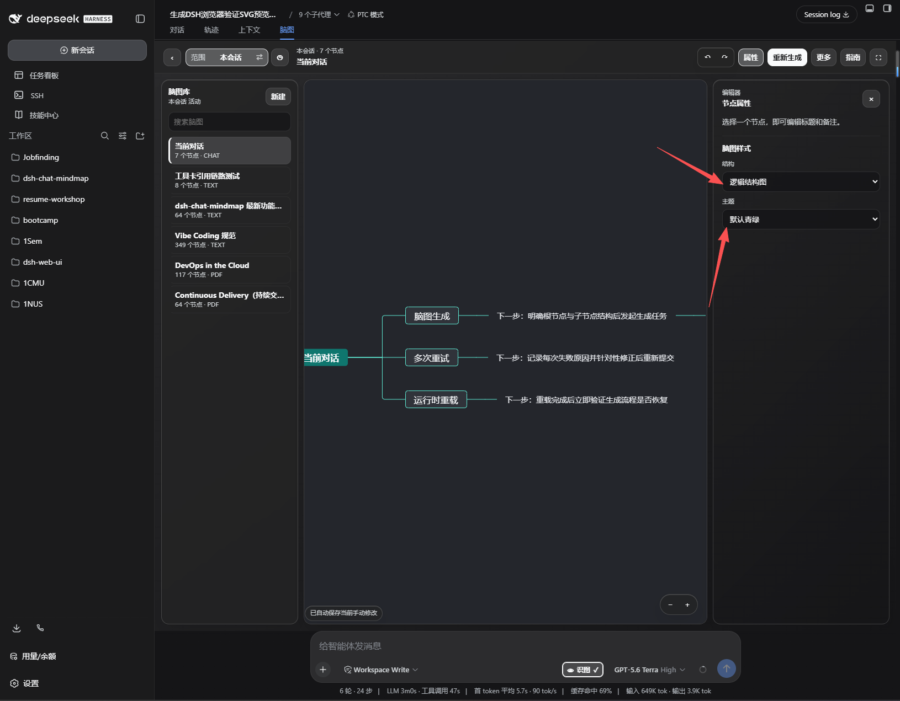

*红箭头标出两个关键外观控件：切换结构组织信息关系，切换主题匹配阅读或交付场景。*

工作台同时提供自动保存状态、缩放与全屏、撤销/重做、全量展开/折叠等日常动作。节点属性与 **更多操作** 由同一处浮层路由管理，打开一个会关闭另一个，避免两个 overlay 重叠抢占操作。

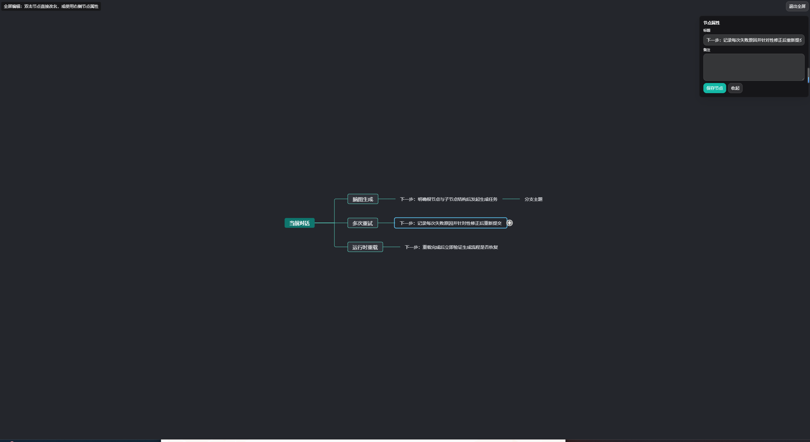

*全屏后保留节点属性编辑器，适合把注意力集中在复杂结构的局部调整上。*

## 用一条要求重整已有脑图

重新生成不是覆盖式的黑箱操作：先在弹窗里说明你希望补强、精简或改写的方向，再提交给 Agent。工作台显示运行状态；完成后会将新结果加载到画布，并保留重新生成前的版本用于恢复。

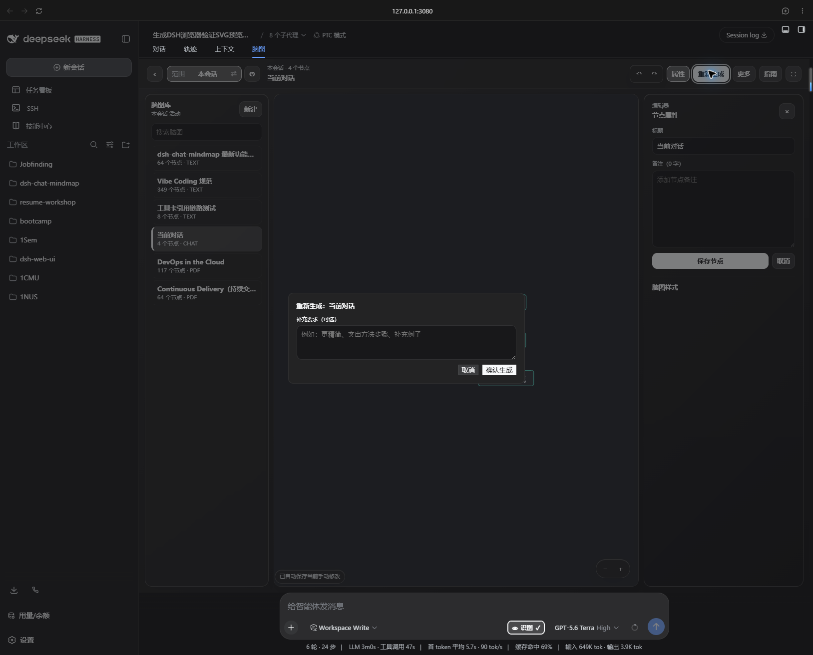

*例如，将当前内容整理为学习路线，并为每条分支补上可执行的下一步。*

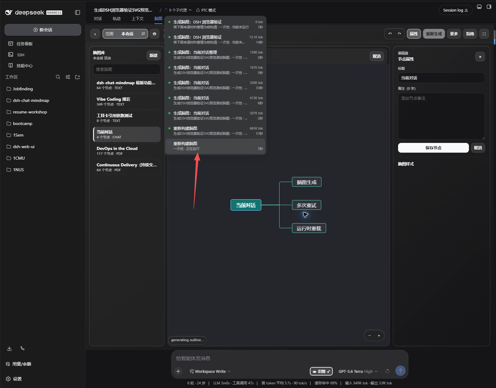

*红箭头指向后台任务状态：生成持续在后台运行，工作台画布仍可保留在当前会话中。*

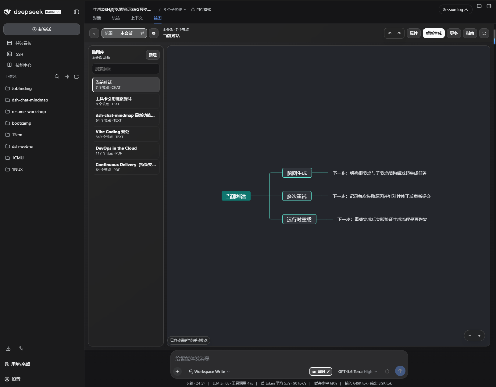

*重新生成后，画布、标题和脑图库一致显示 7 个节点；新增的下一步清晰落在各个分支上。*

## 从一页草图到完整知识图谱

同一工作台也用于较大规模的内容：左侧脑图库保留来源和节点规模，画布可缩放、全屏和折叠，使数百节点的知识结构仍能回到可浏览、可继续编辑的状态。

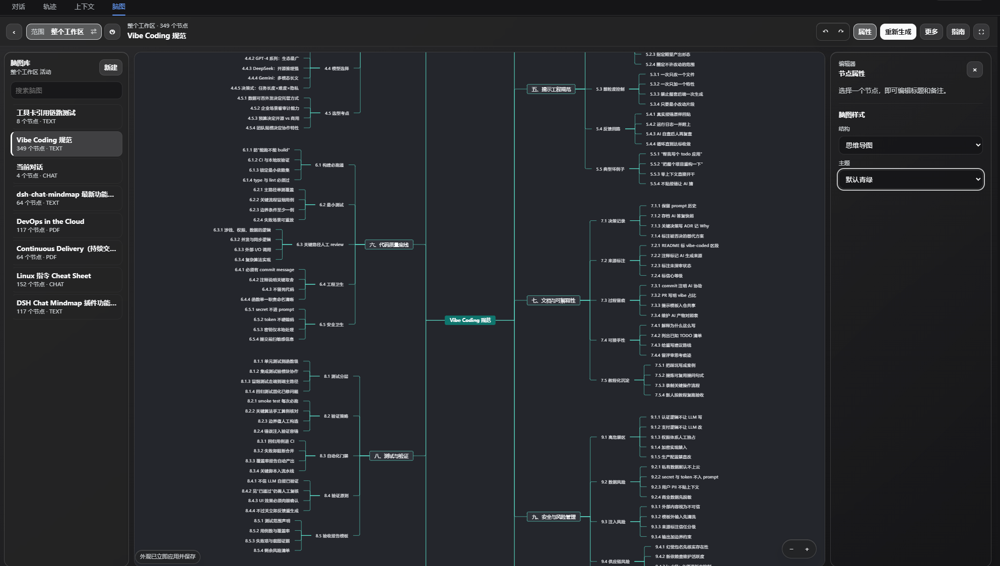

*真实的 349 节点工作区视图：分支层级、节点备注与样式设置仍集中在同一工作台。*

## 导出、版本与整理

把内容整理到满意后，打开 **更多操作**：

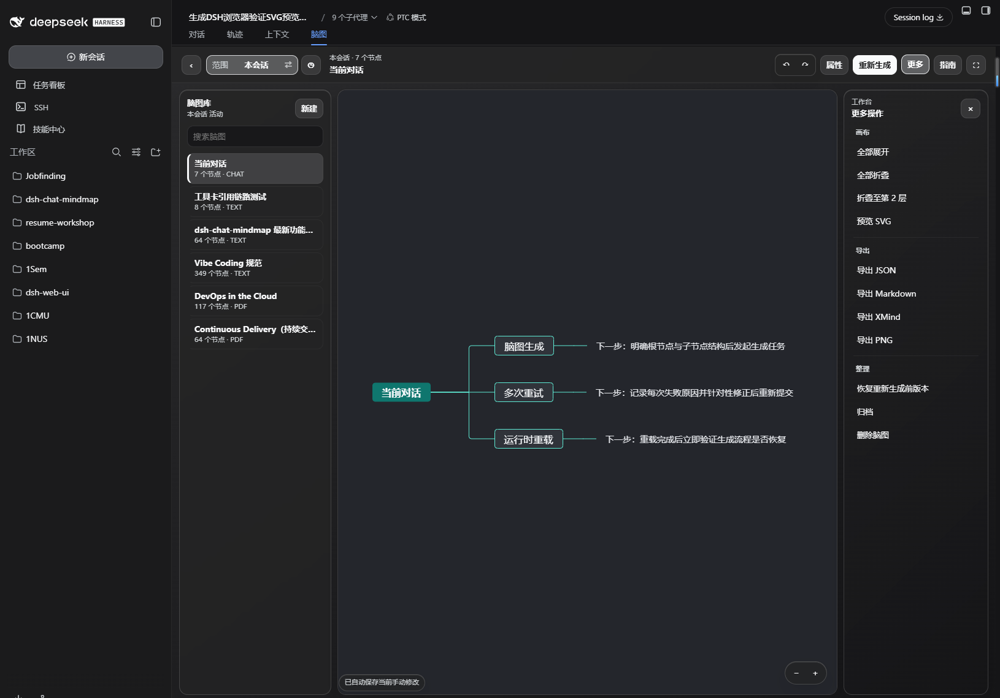

*画布动作、SVG 预览、四种导出和版本整理集中在紧凑的右侧面板，不挤占主画布。*

| 区域 | 操作 | 用途 |
| --- | --- | --- |
| 画布 | 全部展开、全部折叠、折叠至第 2 层、预览 SVG | 在交付前快速调整可读性与查看图形细节。 |
| 导出 | JSON、Markdown、XMind、PNG | 在结构数据、文档、主流脑图工具和图片之间切换。 |
| 整理 | 恢复重新生成前版本、归档、删除 | 保留可逆的整理路径，减少误操作成本。 |

重新生成适合处理“补上风险”“按时间线重组”“只保留行动项”这类二次要求。运行中的生成会显示状态并可取消；如果新结果不理想，可恢复到重新生成前的版本。

## 范围、数据与可靠性

工作台以会话为默认视角，同时允许浏览当前工作区。范围看的是数据，不是仅做 UI 筛选：读取、新建、编辑、删除、恢复、归档和重新生成均带有 session/workspace identity fence，防止跨工作区误读或误写。

自动保存采用取消与顺序保护，避免较早的请求覆盖较新的编辑；并发写入使用 `expectedRecordVersion` 比较并交换，发生冲突时刷新而不是静默覆盖。切换会话后，列表、选择态、主题和布局缓存会同步刷新。

## 个性化设置

插件设置只影响之后新建的脑图，不会悄悄改写已有作品：

| 设置 | 作用 |
| --- | --- |
| 默认布局与主题 | 为新图设定第一眼的结构与气质。 |
| 密度与最大节点数 | 控制生成内容的颗粒度与规模。 |
| 上下文限制 | 控制提供给生成任务的对话上下文范围。 |
| 生成后聚焦与指南 | 决定生成完成后是否自动进入成果，以及是否显示首次使用引导。 |

界面文案跟随浏览器语言偏好，在中文和英文之间切换。

## 兼容性与边界

- 运行环境：DSH Web、Node.js `>=22.18.0 <23`。
- 生成能力取决于宿主提供的 Agent、jobs 与 fork/subagent 服务。缺少这些可选能力时，对应入口会清晰禁用，已有脑图仍可浏览、编辑和导出。
- 插件不新增第三方数据传输服务。生成使用你现有的 DSH Agent/provider 配置，脑图记录按 workspace 作用域保存。
- 工作台内置 SVG 预览；聊天结果一律以“打开脑图”作为可靠入口，以适配不同 DSH 聊天渲染环境。

## 为贡献者准备

```bash
npm ci --legacy-peer-deps
npm run typecheck
npm test
npm run verify:sast
npm run verify:bundle
node scripts/verify-release-readiness.mjs
npm run verify:package
```

依赖升级请独立提交并跑完完整 CI；不要用 `npm audit fix --force` 直接改写锁定依赖。

## 支持与许可

- 源码与反馈：[GitHub Repository](https://github.com/EricWang1358/dsh-chat-mindmap) · [Issues](https://github.com/EricWang1358/dsh-chat-mindmap/issues)
- 发布包：[npm](https://www.npmjs.com/package/@ericwang1358/dsh-chat-mindmap)
- 许可：[MIT](LICENSE)
